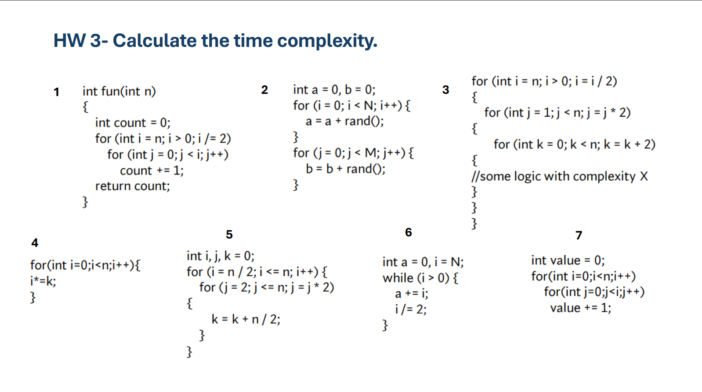
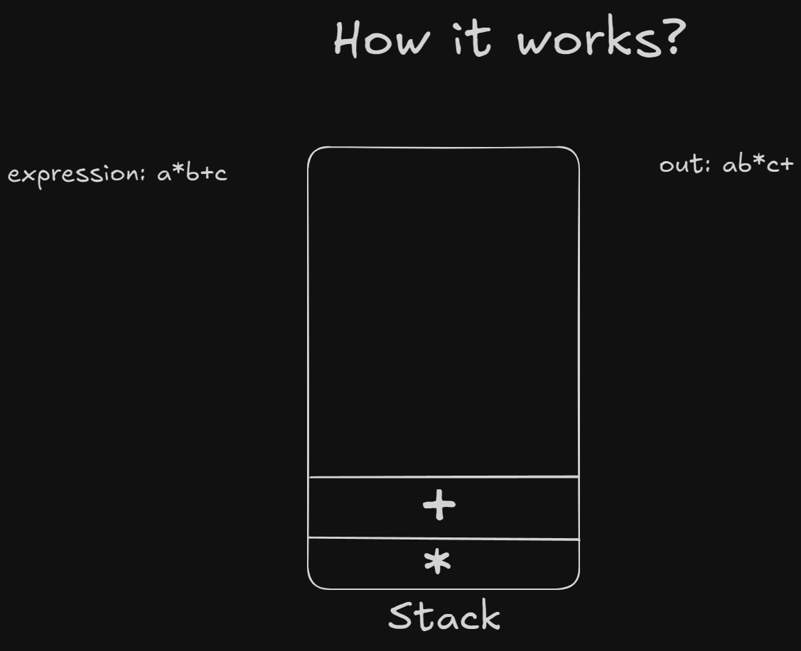
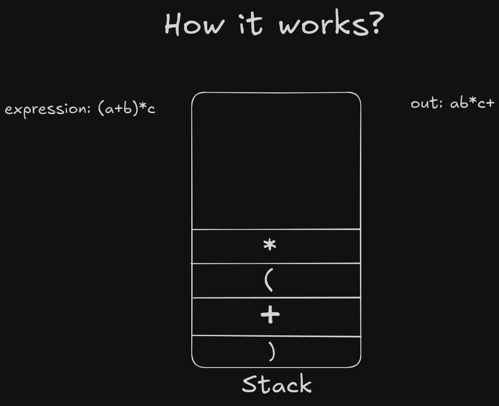
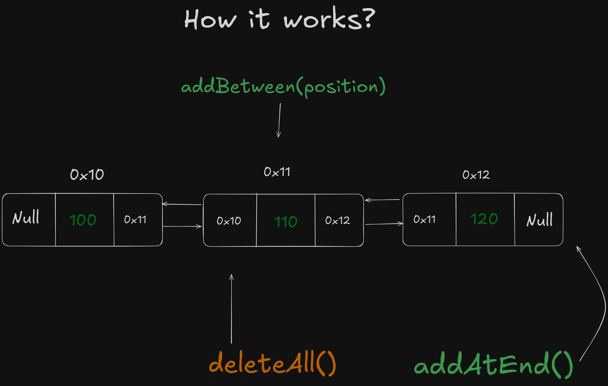
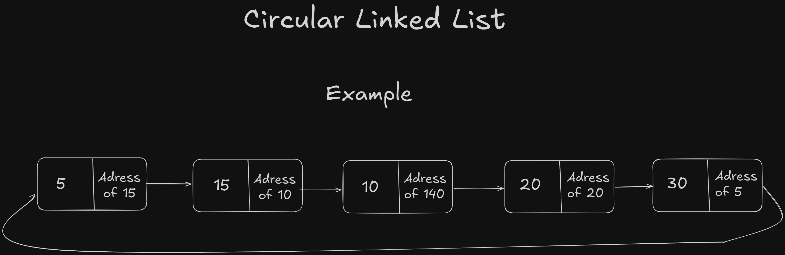
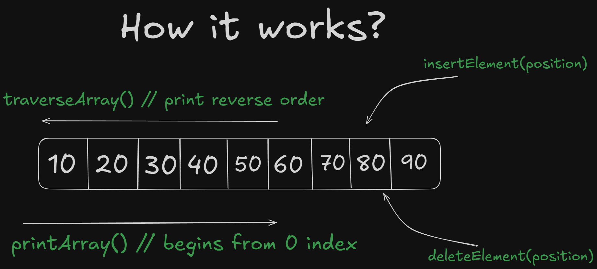
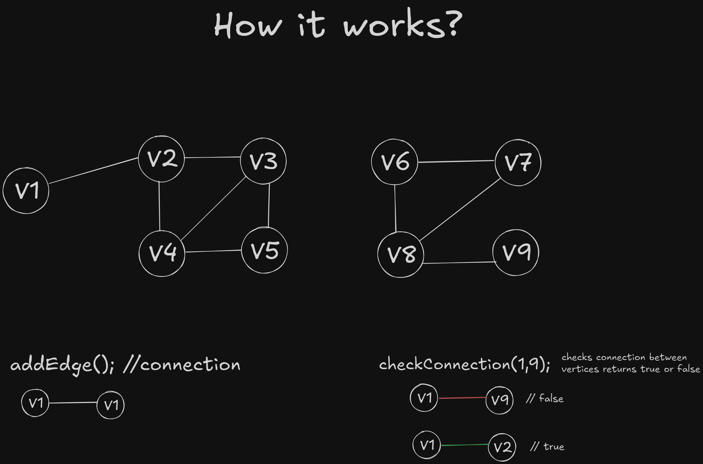
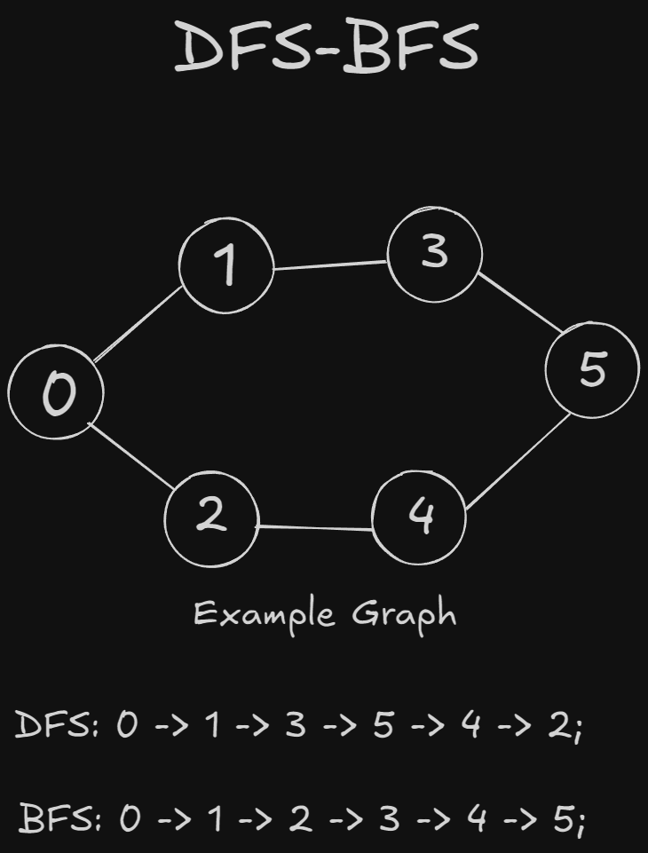
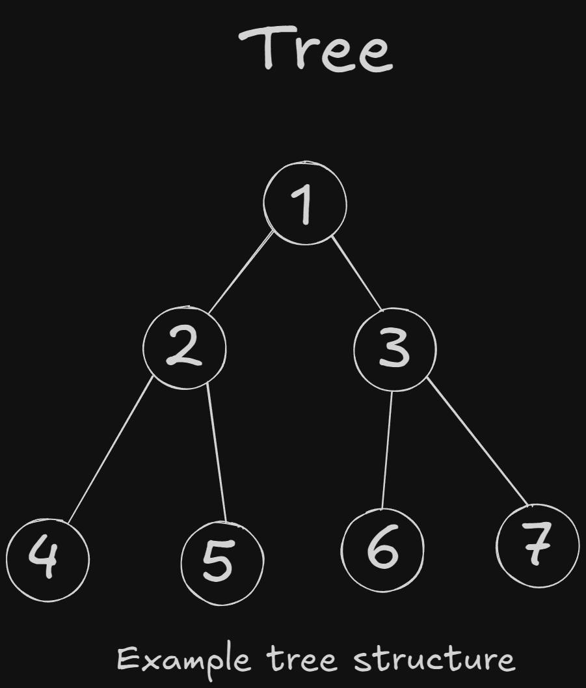
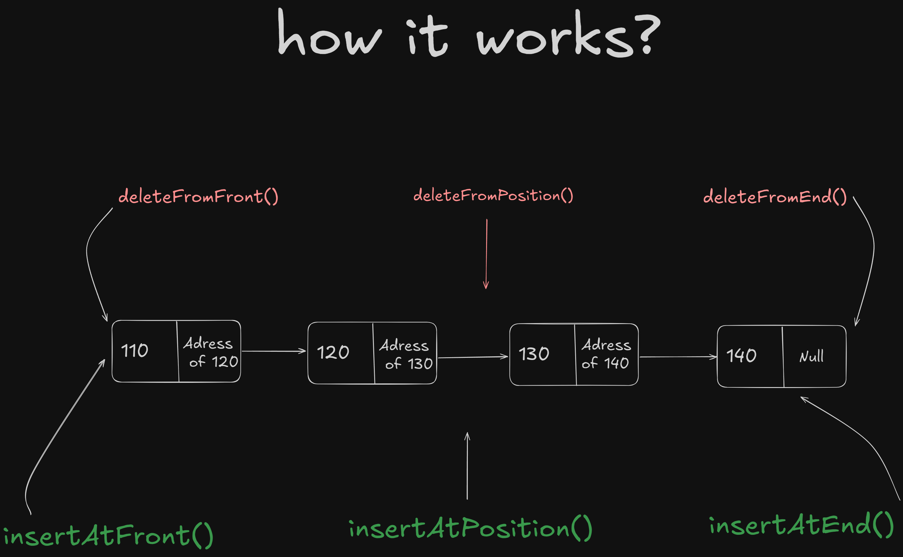

# Data Structure - Assignments & Solutions

#### Author -> **_Abdulaziz Shamsiev_** (2210206543)

---

##  Ödevler

### **1.ödev** - Sparse Matrix Conversion

- **Haftası**: Week 1
- **Dosya**: [week1/matrix.c](week1/matrix.c)
- **Açıklama**: Sparse matrix dönüşümü

### **2.ödev** - Time Complexity Calculation

- **Haftası**: Week 2
- **Dosya**: [week2/struct.c](week2/struct.c)
- **Açıklama**: Zaman karmaşıklığı hesaplama
- **Solution**: 

### **3.ödev** - Infix to Postfix (Shunting Yard Algorithm)

- **Haftası**: Week 5
- **Dosya**: [week5/stack.c](week5/stack.c)
- **Açıklama**: Infix ifadeleri postfix'e dönüştürme (Örn: a*b+c ve (a+b)*c)
- **Solution**:
  | Expression 1 | Expression 2 |
  | :--------------------------------------------------: | :------------------------------------------------------: |
  |  |  |

### **4.ödev** - Min/Max Heap Implementation

- **Haftası**: Week 13
- **Dosya**: [week13/heap.c](week13/heap.c)
- **Açıklama**: Min ve Max heap kodları
- **Solution**: 

### **5.ödev** - Double Linked List Operations

- **Haftası**: Week 4
- **Dosya**: [week4/double-linked-list.c](week4/double-linked-list.c)
- **Açıklama**: Silme, araya ekleme, traversal işlemleri
- **Solution**: 

### **6.ödev** - Circular Linked List Operations

- **Haftası**: Week 3
- **Dosya**: [week3/circular-linked-list.c](week3/circular-linked-list.c)
- **Açıklama**: Silme, araya ekleme, traversal işlemleri
- **Solution**: 



### **7.ödev** - Array Operations

- **Haftası**: Week 1
- **Dosya**: [week1/array.c](week1/array.c)
- **Açıklama**: Traversal, ekleme, silme işlemleri
- **Solution**: 

### **8.ödev** - Graph Clustering

- **Haftası**: Week 11
- **Dosya**: [week11/graph.c](week11/graph.c)
- **Açıklama**: Grafta kümeleme ve ayırma işlemleri
- **Solution**: 

### **9.ödev** - DFS & BFS Implementation

- **Haftası**: Week 9
- **Dosya**: [week9/DFS-BFS.c](week9/DFS-BFS.c)
- **Açıklama**: Derinlik öncelikli arama ve genişlik öncelikli arama uygulaması
- **Solution**: 

### **10.ödev** - Tree Creation Using Array

- **Haftası**: Week 10
- **Dosya**: [week10/tree.c](week10/tree.c)
- **Açıklama**: Dizi kullanarak ağaç oluşturma
- **Solution**: 


---
## Extra's

- **Haftası**: Week 3
- **Dosya**: [recursion.c](week3/recursion.c), [linked-list.c](week3/linked-list.c), [hashmaps](./notes/hashmaps.pdf)
- **Açıklama**: Recursive ve linked list örnekleri
- **Solution**: 


---
##  Çalıştırma

### Online Derleyici Kullanarak

Kodu kopyalayıp şu sitelerden birine yapıştırın:

- [OnlineGDB](https://www.onlinegdb.com/online_c_compiler)
- [Programiz](https://www.programiz.com/c-programming/online-compiler/)

### Yerel Olarak Çalıştırma

Terminal'de GCC kullanarak:

```bash
gcc week1/array.c -o array && ./array.exe
```